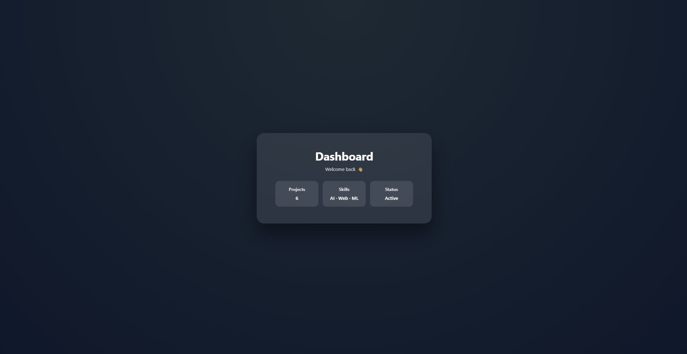

---

## 📘 `EXP_3_3_README.md`

# Experiment 3.3 – Styled UI with Routing

## Aim  
To build a visually enhanced React application using routing and external CSS for a modern UI.

## Theory  
Routing enables page-level navigation in a single-page application.  
In this experiment, routing is combined with:

- Custom CSS (`App.css`)
- Glassmorphism UI
- Card-based layout

Routes used:

- `/` → Dashboard  
- `/profile` → Profile  

## Implementation  

<BrowserRouter>
  <Routes>
    <Route path="/" element={<Dashboard />} />
    <Route path="/profile" element={<Profile />} />
  </Routes>
</BrowserRouter>
## Output Screenshots

### Dashboard UI

### Profile UI

