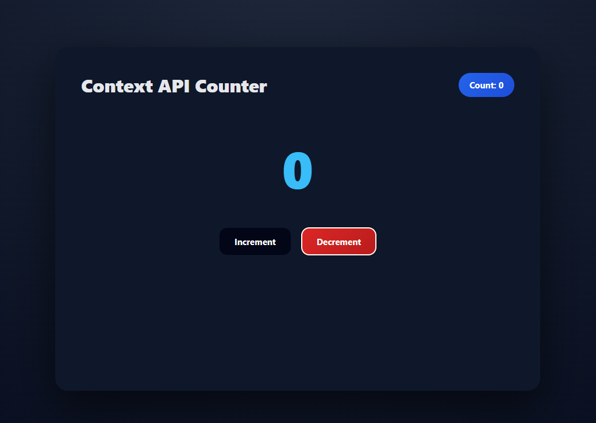

# EXP4.1: React Context API Counter

A simple counter application demonstrating the use of React's **Context API** for state management without external libraries.

## Features

- ✨ Simple counter with increment/decrement functionality
- 🎯 Context API for global state management
- 🎨 Clean and responsive UI
- ⚡ Built with React and Vite

## Technologies Used

- React (v19+)
- Vite
- CSS3

## Installation & Setup

1. Navigate to the project directory
   ```bash
   cd EXP4.1
   ```

2. Install dependencies
   ```bash
   npm install
   ```

3. Start the development server
   ```bash
   npm run dev
   ```

4. Open `http://localhost:5173` in your browser

## Project Structure

```
src/
├── App.jsx       # Main component with Context Provider
├── App.css       # Styling
├── main.jsx      # React entry point
└── index.css     # Global styles
```

## How It Works

- **CounterContext**: Created using `createContext()` to store counter state
- **Provider**: App component wraps children with `CounterContext.Provider`
- **useContext Hook**: Components access count and methods from context
- **State Management**: `useState` hook manages the counter value

## Key Concepts

- Context API for avoiding prop drilling
- `createContext()` for creating context
- `useContext()` hook for consuming context values
- Local state management with `useState()`

## Screenshots



## Usage

1. Click **Increment** button to increase the count
2. Click **Decrement** button to decrease the count (minimum is 0)
3. The header displays the current count value
