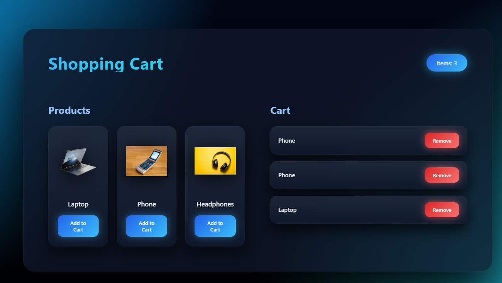

# EXP4.2: Shopping Cart with Redux

A shopping cart application demonstrating **Redux** for managing cart state with product management features.

## Features

- 🛒 Add and remove products from cart
- 📊 Display cart item count
- 💻 Product showcase with images
- 🔄 Redux state management
- 🎨 Clean and intuitive UI
- ⚡ Built with React and Vite

## Technologies Used

- React (v19+)
- Redux Toolkit
- Vite
- CSS3

## Installation & Setup

1. Navigate to the project directory
   ```bash
   cd EXP4.2
   ```

2. Install dependencies
   ```bash
   npm install
   ```

3. Start the development server
   ```bash
   npm run dev
   ```

4. Open `http://localhost:5173` in your browser

## Project Structure

```
src/
├── App.jsx       # Main component with cart and products
├── store.js      # Redux store configuration
├── App.css       # Styling
├── assets/       # Product images
├── main.jsx      # React entry point
└── index.css     # Global styles
```

## How It Works

- **Redux Store**: Manages cart items in global state
- **addItem Action**: Adds product name to cart
- **removeItem Action**: Removes product from cart
- **useSelector()**: Accesses cart state from Redux
- **useDispatch()**: Dispatches add/remove actions
- **Product List**: Shows available products with images
- **Cart Display**: Shows added items with remove option

## Key Concepts

- Redux for cart state management
- Actions for adding and removing items
- Product list management
- Dynamic item count display
- Empty cart state handling

## Screenshots

### Initial page of shopping cart with item counter


### Redux Toolkit extension in use


## Usage

1. Browse the **Products** section
2. Click **Add to Cart** to add items
3. View **Cart** section with added items
4. Click **Remove** to delete items from cart
5. Cart item count updates automatically
