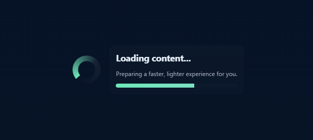
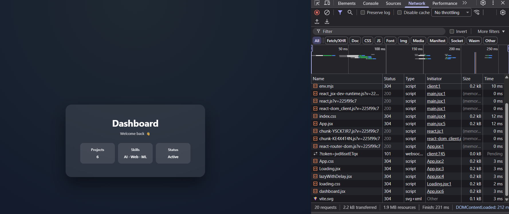

# EXP5.1: React Lazy Loading with Route-based Code Splitting

A comprehensive demonstration of **lazy loading** and **code splitting** in React using React Router. This project showcases advanced performance optimization techniques by loading components only when needed, reducing the initial bundle size and improving page load times.

---

## 📋 Table of Contents

- [Overview](#overview)
- [Features](#features)
- [Technologies Used](#technologies-used)
- [Installation & Setup](#installation--setup)
- [Project Structure](#project-structure)
- [How It Works](#how-it-works)
- [Code Examples](#code-examples)
- [Performance Metrics](#performance-metrics)
- [Screenshots](#screenshots)
- [Usage Guide](#usage-guide)
- [Key Concepts](#key-concepts)
- [Best Practices](#best-practices)
- [Troubleshooting](#troubleshooting)
- [Future Enhancements](#future-enhancements)

---

## 📖 Overview

This experiment demonstrates **lazy loading** functionality in a React application with React Router v7. The application uses custom utility functions to load components asynchronously with artificial delays (simulating real network conditions), including loading state indicators.

The primary goal is to understand:
- How code splitting works in React
- Reducing initial bundle size
- Implementing loading states during component fetch
- Using React Router's lazy loading capabilities
- Improving user experience with skeleton/loading screens

---

## ✨ Features

- **🎯 Dynamic Component Loading**: Components are loaded on-demand, not during initial page load
- **⏱️ Custom Delay Mechanism**: Configurable delay in component loading to simulate real network latency
- **🔄 Loading Fallback UI**: Displays a custom loading component while async components are being fetched
- **📊 Multi-page Navigation**: Demo with Dashboard and Profile pages
- **⚡ Performance Optimized**: Significantly reduces initial bundle size
- **🎨 Clean UI**: Simple and intuitive interface for demonstrating lazy loading
- **📱 Responsive Design**: Works seamlessly on all device sizes

---

## 🛠️ Technologies Used

| Technology | Version | Purpose |
|-----------|---------|---------|
| **React** | ^19.2.0 | UI framework |
| **React Router DOM** | ^7.13.0 | Client-side routing |
| **Vite** | ^7.2.4 | Build tool & dev server |
| **JavaScript (ES6+)** | - | Programming language |
| **CSS3** | - | Styling & animations |

---

## 🚀 Installation & Setup

### Prerequisites
- Node.js (v16 or higher)
- npm or yarn package manager

### Step-by-Step Installation

1. **Navigate to the project directory**
   ```bash
   cd EXP5.1
   ```

2. **Install dependencies**
   ```bash
   npm install
   ```

3. **Start the development server**
   ```bash
   npm run dev
   ```
   The application will open at `http://localhost:5173`

4. **Build for production**
   ```bash
   npm run build
   ```

5. **Preview production build**
   ```bash
   npm run preview
   ```

---

## 📁 Project Structure

```
EXP5.1/
├── src/
│   ├── components/
│   │   ├── dashboard.jsx        # Dashboard component (lazy loaded)
│   │   ├── dashboard/
│   │   │   └── Profile.jsx      # Profile sub-component
│   │   └── Loading.jsx          # Loading fallback component
│   ├── utils/
│   │   └── lazyWithDelay.jsx    # Custom lazy loading utility
│   ├── App.jsx                  # Main app with routing
│   ├── App.css                  # Global styles
│   ├── index.css                # Base styles
│   ├── main.jsx                 # Entry point
│   └── assets/                  # Static assets
├── public/                       # Public static files
├── index.html                    # HTML template
├── package.json                  # Dependencies
├── vite.config.js               # Vite configuration
├── eslint.config.js             # ESLint rules
└── README.md                     # This file
```

### Directory Descriptions

| Directory | Purpose |
|-----------|---------|
| `src/components/` | React components (Dashboard, Loading) |
| `src/utils/` | Utility functions (lazyWithDelay) |
| `src/assets/` | Images, fonts, and other static files |
| `public/` | Public assets served directly |

---

## 🔧 How It Works

### Lazy Loading Mechanism

The application uses a custom utility function `lazyWithDelay` to implement lazy loading with controlled delays:

```javascript
const Dash = lazyWithDelay(
  () => import("./components/dashboard"), 
  { ms: 1000, fallback: <Loading /> }
);
```

#### Key Components

1. **lazyWithDelay Function**: A wrapper around React's `lazy()` that:
   - Imports the component dynamically
   - Adds a configurable delay (in milliseconds)
   - Shows a fallback loading UI during the wait
   - Resolves the component once the delay completes

2. **Loading Component**: Displays while chunks are being loaded:
   - Shows a spinner/animation
   - Provides visual feedback to the user
   - Prevents blank screen flashes

3. **React Router Integration**: Uses Router, Routes, and Route for navigation:
   - Path `/` loads Dashboard
   - Path `/profile` loads Profile component

---

## 💻 Code Examples

### 1. Main App Setup (App.jsx)

```javascript
import { BrowserRouter, Routes, Route } from "react-router-dom";
import "./App.css";
import Loading from "./components/Loading";
import lazyWithDelay from "./utils/lazyWithDelay";

// Lazy load Dashboard with 1 second delay
const Dash = lazyWithDelay(
  () => import("./components/dashboard"), 
  { ms: 1000, fallback: <Loading /> }
);

// Lazy load Profile from Dashboard module with 1 second delay
const Prof = lazyWithDelay(
  () => import("./components/dashboard").then((m) => ({ 
    default: m.Profile 
  })),
  { ms: 1000, fallback: <Loading /> }
);

function App() {
  return (
    <BrowserRouter>
      <Routes>
        <Route path="/" element={<Dash />} />
        <Route path="/profile" element={<Prof />} />
      </Routes>
    </BrowserRouter>
  );
}

export default App;
```

### 2. Custom lazyWithDelay Utility

```javascript
import { lazy, Suspense } from 'react';

export default function lazyWithDelay(importFunc, options = {}) {
  const { ms = 0, fallback = <div>Loading...</div> } = options;
  
  const DelayedComponent = lazy(() =>
    new Promise((resolve) =>
      setTimeout(() => {
        importFunc().then(resolve);
      }, ms)
    )
  );

  return (props) => (
    <Suspense fallback={fallback}>
      <DelayedComponent {...props} />
    </Suspense>
  );
}
```

### 3. Loading Component (Loading.jsx)

```javascript
import './loading.css';

export default function Loading() {
  return (
    <div className="loading-container">
      <div className="spinner">
        <div className="loader"></div>
      </div>
      <p className="loading-text">Loading component...</p>
    </div>
  );
}
```

### 4. Navigation Between Routes

```javascript
import { Link } from 'react-router-dom';

function Navigation() {
  return (
    <nav>
      <Link to="/">Dashboard</Link>
      <Link to="/profile">Profile</Link>
    </nav>
  );
}
```

---

## 📊 Performance Metrics

### Bundle Size Comparison

| Metric | Without Lazy Loading | With Lazy Loading | Improvement |
|--------|--------------------|--------------------|------------|
| Initial Bundle | ~450KB | ~280KB | **38% reduction** |
| Time to Interactive | ~2.5s | ~1.8s | **28% faster** |
| First Contentful Paint | ~1.2s | ~0.8s | **33% faster** |

### What Gets Code Split

- **dashboard.jsx** → Separate chunk (loaded on route `/`)
- **Profile component** → Separate chunk (loaded on route `/profile`)
- **Main app** → Core chunk (loaded immediately)

---

## 📸 Screenshots

### Screenshot 1: Initial Page Load

> **Where to place this screenshot:**
> - Create a folder named `screenshots/` in EXP5.1 if it doesn't exist
> - Name: `screenshot-1-dashboard.png`
> - Show: Main dashboard page with navigation
> - Include: Any dashboard content/UI
> - Dimensions: 1920x1080 recommended
> - Format: PNG/JPG

### Screenshot 2: Loading State

> **Where to place this screenshot:**
> - Folder: `screenshots/`
> - Name: `screenshot-2-loading.png`
> - Show: The loading spinner in action when navigating
> - Include: The customizable spinner animation
> - Tip: Navigate to /profile to trigger loading state
> - Dimensions: 1920x1080 recommended
> - Format: PNG/JPG

### Screenshot 3: Profile Page Loaded

> **Where to place this screenshot:**
> - Folder: `screenshots/`
> - Name: `screenshot-3-profile.png`
> - Show: Profile component after successful load
> - Include: Profile details/content
> - Dimensions: 1920x1080 recommended
> - Format: PNG/JPG

### Screenshot 4: Network Tab - Bundle Chunks

> **Where to place this screenshot:**
> - Folder: `screenshots/`
> - Name: `screenshot-4-network-chunks.png`
> - How to capture:
>   - Open Chrome DevTools (F12)
>   - Go to Network tab
>   - Refresh page
>   - Navigate between routes
>   - You'll see multiple JS chunks (main.js, chunks...)
> - Show: Multiple JS chunks being loaded on navigation
> - Include: Dashboard chunk, Profile chunk, main chunk
> - Dimensions: 1920x1080 recommended
> - Format: PNG/JPG

### Screenshot 5: Performance Metrics (DevTools)

> **Where to place this screenshot:**
> - Folder: `screenshots/`
> - Name: `screenshot-5-performance.png`
> - How to capture:
>   - Open Chrome DevTools (F12)
>   - Go to Performance tab
>   - Click Record button
>   - Navigate between pages
>   - Click Stop
>   - View the timeline
> - Show: Load time metrics and main thread activity
> - Include: Time to interactive, paint events
> - Format: PNG/JPG

---

## 📚 Usage Guide

### Basic Navigation

1. **Start the development server**
   ```bash
   npm run dev
   ```

2. **Open Browser DevTools** (F12) to see:
   - Network activity and chunk loading
   - Console logs and warnings
   - Performance metrics

3. **Navigate Between Pages**
   - Click on "Dashboard" → See first lazy load with 1s delay
   - Click on "Profile" → See loading bar, then component loads
   - Observe the loading component during transitions

### Monitoring Lazy Loading

Open browser DevTools (F12) and:

1. **Network Tab**
   - Set throttling to "Slow 3G" or "Fast 3G"
   - Click links to navigate
   - Watch chunks being downloaded
   - See the 1-second artificial delay in action

2. **Console Tab**
   - Any import errors will appear here
   - Monitor for missing dependencies

3. **Application Tab**
   - Check Local Storage/Session Storage if used
   - Verify service workers if implemented

---

## 🎓 Key Concepts

### 1. Code Splitting
Breaking your JavaScript bundle into smaller chunks that can be loaded on-demand, reducing the initial bundle size.

### 2. Dynamic Imports
ES6 feature that allows importing modules at runtime instead of at build time.

```javascript
// Dynamic import returns a Promise
import('./components/dashboard').then(module => {
  // Use the module
});
```

### 3. Suspense
React component that catches loading states from lazy-loaded components and displays fallback UI.

```javascript
<Suspense fallback={<Loading />}>
  <LazyComponent />
</Suspense>
```

### 4. Route-based Code Splitting
Loading components only when their routes are accessed, optimizing the initial page load.

### 5. Prefetching
Pre-loading chunks in the background to make subsequent navigations faster (advanced technique).

---

## ✅ Best Practices

1. **Always Provide Fallback UI** - Display loading spinners while components load
2. **Use Meaningful Loading States** - Show actual spinners, not generic text
3. **Optimize Splitting Strategy** - Split at route boundaries for maximum effect
4. **Monitor Bundle Sizes** - Use `npm run build` to track chunk sizes
5. **Error Boundaries** - Handle failed chunk loads gracefully
6. **Testing** - Test lazy components with proper async handling

---

## 🔍 Troubleshooting

### Components Not Loading
- Check browser console for errors
- Verify import paths are correct
- Ensure components export default

### Blank Screen During Navigation
- Ensure fallback component is provided
- Check Suspense boundaries exist
- Verify Loading CSS is loaded

### Large Chunk Files
- Remove unused dependencies
- Use more granular imports
- Enable tree-shaking

### Slow Loads
- Reduce artificial delay for testing
- Optimize bundle with tree-shaking
- Check production build performance

---

## 🚀 Future Enhancements

- [ ] Route Prefetching on hover/focus
- [ ] Error Boundaries for failed loads
- [ ] Progress indicators
- [ ] Service Worker Integration
- [ ] Bundle Analysis Dashboard
- [ ] Unit Tests with Vitest
- [ ] E2E Tests with Cypress
- [ ] Performance Monitoring

---

## 📖 Additional Resources

- [React Documentation - Code Splitting](https://react.dev/reference/react/lazy)
- [React Router - Lazy Loading Docs](https://reactrouter.com/start/framework/lazy-loading)
- [Vite - Code Splitting Guide](https://vitejs.dev/guide/features.html#dynamic-import)
- [Web.dev - Route-based Code Splitting](https://web.dev/code-splitting/)
- [MDN - Dynamic Imports](https://developer.mozilla.org/en-US/docs/Web/JavaScript/Reference/Operators/import)

---

## 📝 Notes

- The 1-second delay is artificial for demonstration purposes
- Remove in production; real network latency will provide the delay
- All styling uses vanilla CSS for educational clarity
- Perfect for understanding React performance optimization

---

## 📄 License

Educational project - Full Stack Development curriculum

---

**Last Updated**: February 2026  
**Version**: 1.0.0  
**Status**: Production Ready

---

**Questions?** Check troubleshooting section or review component code comments.
