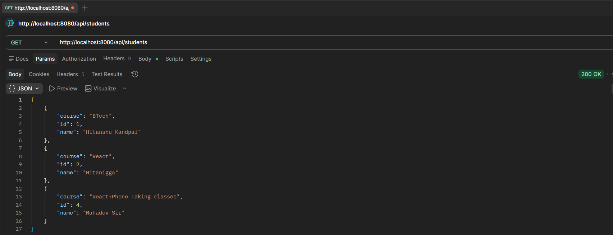
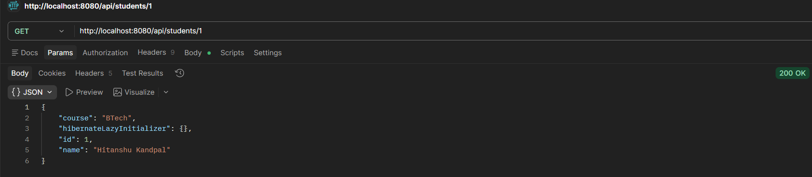
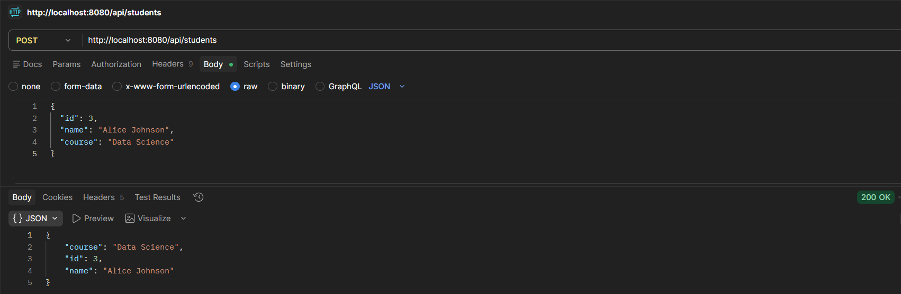
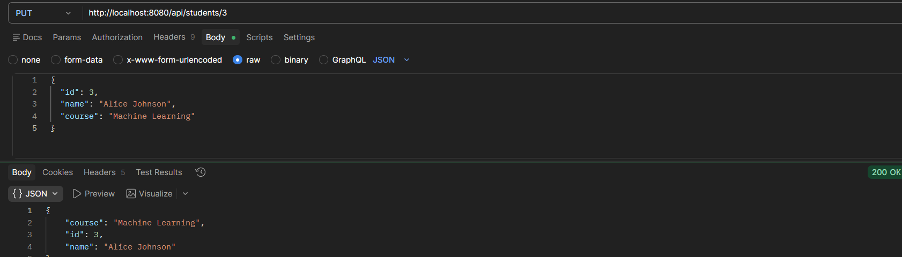
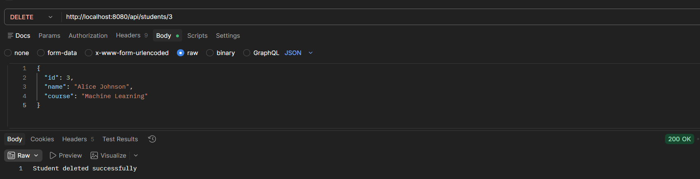

# Student Management REST API

A Spring Boot REST API for managing student records with MySQL database integration.

## Table of Contents

- [Overview](#overview)
- [Features](#features)
- [Technologies Used](#technologies-used)
- [Prerequisites](#prerequisites)
- [Installation](#installation)
- [Database Setup](#database-setup)
- [Running the Application](#running-the-application)
- [API Endpoints](#api-endpoints)
  - [Get All Students](#get-all-students)
  - [Get Student by ID](#get-student-by-id)
  - [Create Student](#create-student)
  - [Update Student](#update-student)
  - [Delete Student](#delete-student)
- [API Testing with Postman](#api-testing-with-postman)
- [Project Structure](#project-structure)
- [Contributing](#contributing)
- [License](#license)

## Overview

This REST API provides CRUD (Create, Read, Update, Delete) operations for managing student information. The API is built using Spring Boot and uses MySQL as the database.

## Features

- ✅ Get all students
- ✅ Get student by ID
- ✅ Create new student
- ✅ Update existing student
- ✅ Delete student
- ✅ MySQL database integration
- ✅ JPA/Hibernate ORM

## Technologies Used

- **Java 21**
- **Spring Boot 4.0.3**
- **Spring Data JPA**
- **Spring Web MVC**
- **MySQL Database**
- **Maven** (Build Tool)
- **Hibernate** (ORM)

## Prerequisites

Before running this application, make sure you have the following installed:

- Java 21 or higher
- MySQL Server
- Maven 3.6+
- Postman (for API testing)

## Installation

1. **Clone the repository:**
   ```bash
   git clone <repository-url>
   cd Rest-API
   ```

2. **Install dependencies:**
   ```bash
   mvn clean install
   ```

## Database Setup

1. **Create MySQL Database:**
   ```sql
   CREATE DATABASE chandigarh_university;
   ```

2. **Update Database Credentials:**
   - Open `src/main/resources/application.properties`
   - Update the following properties if needed:
     ```properties
     spring.datasource.url=jdbc:mysql://localhost:3306/chandigarh_university
     spring.datasource.username=your_username
     spring.datasource.password=your_password
     ```

## Running the Application

1. **Start MySQL Server** (if not already running)

2. **Run the Spring Boot application:**
   ```bash
   mvn spring-boot:run
   ```

3. **Verify the application is running:**
   - Open your browser and go to: `http://localhost:8080`
   - The application should be running on port 8080

## API Endpoints

The API provides the following endpoints for student management:

### Base URL
```
http://localhost:8080/api/students
```

### Student Model
```json
{
  "id": 1,
  "name": "John Doe",
  "course": "Computer Science"
}
```

### Get All Students

**GET** `/api/students`

Retrieves a list of all students.

**Response:**
```json
[
  {
    "id": 1,
    "name": "John Doe",
    "course": "Computer Science"
  },
  {
    "id": 2,
    "name": "Jane Smith",
    "course": "Information Technology"
  }
]
```

**Postman Screenshot Placeholder:**


---

### Get Student by ID

**GET** `/api/students/{id}`

Retrieves a specific student by their ID.

**Parameters:**
- `id` (path parameter): Student ID (integer)

**Example:** `GET /api/students/1`

**Response:**
```json
{
  "id": 1,
  "name": "John Doe",
  "course": "Computer Science"
}
```

**Postman Screenshot Placeholder:**


---

### Create Student

**POST** `/api/students`

Creates a new student record.

**Request Body:**
```json
{
  "id": 3,
  "name": "Alice Johnson",
  "course": "Data Science"
}
```

**Response:**
```json
{
  "id": 3,
  "name": "Alice Johnson",
  "course": "Data Science"
}
```

**Postman Screenshot Placeholder:**


---

### Update Student

**PUT** `/api/students/{id}`

Updates an existing student record.

**Parameters:**
- `id` (path parameter): Student ID to update (integer)

**Request Body:**
```json
{
  "id": 3,
  "name": "Alice Johnson",
  "course": "Machine Learning"
}
```

**Response:**
```json
{
  "id": 3,
  "name": "Alice Johnson",
  "course": "Machine Learning"
}
```

**Postman Screenshot Placeholder:**


---

### Delete Student

**DELETE** `/api/students/{id}`

Deletes a student record by ID.

**Parameters:**
- `id` (path parameter): Student ID to delete (integer)

**Example:** `DELETE /api/students/3`

**Response:**
```
"Student deleted successfully"
```

**Postman Screenshot Placeholder:**


## API Testing with Postman

1. **Import the collection** (if available) or manually create requests
2. **Set base URL:** `http://localhost:8080/api/students`
3. **Test each endpoint** with appropriate HTTP methods and request bodies
4. **Verify responses** match the expected JSON structure

**Sample Postman Collection Structure:**
- **Student Management API**
  - GET All Students
  - GET Student by ID
  - POST Create Student
  - PUT Update Student
  - DELETE Delete Student

## Project Structure

```
Rest-API/
├── src/
│   ├── main/
│   │   ├── java/
│   │   │   └── com/AML2A/Rest_API/
│   │   │       ├── controller/
│   │   │       │   └── StudentController.java
│   │   │       ├── model/
│   │   │       │   └── Student.java
│   │   │       ├── repository/
│   │   │       ├── service/
│   │   │       └── RestApiApplication.java
│   │   └── resources/
│   │       ├── application.properties
│   │       └── static/
│   └── test/
├── pom.xml
├── mvnw
├── mvnw.cmd
└── README.md
```

## Contributing

1. Fork the repository
2. Create a feature branch (`git checkout -b feature/AmazingFeature`)
3. Commit your changes (`git commit -m 'Add some AmazingFeature'`)
4. Push to the branch (`git push origin feature/AmazingFeature`)
5. Open a Pull Request

## License

This project is licensed under the MIT License - see the [LICENSE](LICENSE) file for details.