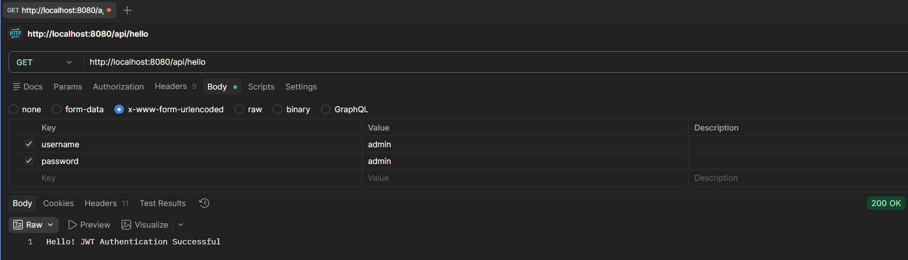
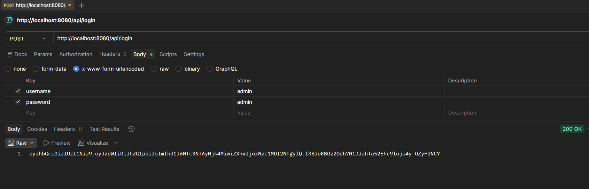

# JWT Authentication Demo

A Spring Boot application demonstrating JWT (JSON Web Token) authentication for secure API access.

## Description

This project implements a complete JWT authentication system using Spring Boot and Spring Security. Users can register, login, and access protected endpoints using JWT tokens obtained through Postman or similar API clients.

## Features

- User registration and authentication
- JWT token generation and validation
- Protected API endpoints
- MySQL database integration
- Spring Security configuration

## Tech Stack

- **Backend**: Spring Boot 4.0.5
- **Security**: Spring Security
- **Database**: MySQL
- **Build Tool**: Maven
- **Java Version**: 21

## Project Structure

```
JWT-DEMO/
├── src/
│   ├── main/
│   │   ├── java/
│   │   │   └── com/AML_2A/JWT_DEMO/
│   │   │       ├── controller/
│   │   │       │   ├── AuthController.java
│   │   │       │   └── UserController.java
│   │   │       ├── model/
│   │   │       │   └── User.java
│   │   │       ├── repository/
│   │   │       │   └── UserRepository.java
│   │   │       ├── service/
│   │   │       │   ├── UserService.java
│   │   │       │   └── JwtService.java
│   │   │       ├── config/
│   │   │       │   └── SecurityConfig.java
│   │   │       └── JwtDemoApplication.java
│   │   └── resources/
│   │       └── application.properties
│   └── test/
│       └── java/
│           └── com/AML_2A/JWT_DEMO/
│               └── JwtDemoApplicationTests.java
├── pom.xml
├── mvnw
├── mvnw.cmd
└── README.md
```

## API Endpoints

### Authentication Endpoints

| Method | Endpoint | Description | Request Body |
|--------|----------|-------------|--------------|
| POST | `/api/auth/register` | Register a new user | `{ "username": "string", "password": "string", "email": "string" }` |
| POST | `/api/auth/login` | Login and get JWT token | `{ "username": "string", "password": "string" }` |

### Protected Endpoints

| Method | Endpoint | Description | Headers |
|--------|----------|-------------|---------|
| GET | `/api/users/profile` | Get user profile | `Authorization: Bearer <jwt_token>` |
| GET | `/api/users/all` | Get all users (admin only) | `Authorization: Bearer <jwt_token>` |

## Setup Instructions

1. **Clone the repository**
   ```bash
   git clone <repository-url>
   cd JWT-DEMO
   ```

2. **Configure Database**
   - Create a MySQL database
   - Update `src/main/resources/application.properties` with your database credentials:
   ```properties
   spring.datasource.url=jdbc:mysql://localhost:3306/your_database
   spring.datasource.username=your_username
   spring.datasource.password=your_password
   ```

3. **Build the project**
   ```bash
   ./mvnw clean install
   ```

4. **Run the application**
   ```bash
   ./mvnw spring-boot:run
   ```

The application will start on `http://localhost:8080`

## Usage

### Using Postman

1. **Register a new user**
   - Method: POST
   - URL: `http://localhost:8080/api/hello`
   - Body (JSON):
     ```json
     {
       "username": "testuser",
       "password": "password123",
       "email": "test@example.com"
     }
     ```

2. **Login to get JWT token**
   - Method: POST
   - URL: `http://localhost:8080/api/login`
   - Body (JSON):
     ```json
     {
       "username": "testuser",
       "password": "password123"
     }
     ```
   - Response will contain the JWT token

3. **Access protected endpoints**
   - Method: GET
   - URL: `http://localhost:8080/api/users/profile`
   - Headers:
     - `Authorization: Bearer <your_jwt_token>`

## Screenshots

### 1. User Registration



### 3. JWT Login + Token Response



## Dependencies

- Spring Boot Starter Web
- Spring Boot Starter Security
- Spring Boot Starter Data JPA
- MySQL Connector/J
- Spring Boot Starter Test

## Security Configuration

The application uses Spring Security with JWT for stateless authentication. The security configuration includes:
- JWT token validation
- Role-based access control
- CORS configuration
- Password encoding

## Contributing

1. Fork the repository
2. Create a feature branch
3. Commit your changes
4. Push to the branch
5. Create a Pull Request

## License

This project is licensed under the MIT License.
